#### Table of Contents


# Explainer
-------------------------
This document shows the diagram components you can create using markdown.

The components are enabled through the `rehype-mermaidjs` plugin. See the [rehype-mermaidjs docs](https://github.com/remcohaszing/rehype-mermaidjs)

> [!tip]
> See the full syntax used to render markdown diagrams here - [Mermaid syntax documentation](https://mermaid-js.github.io/mermaid/#/n00b-syntaxReference)


# Simple Diagram
-------------------------
#### Markdown Example
```markdown
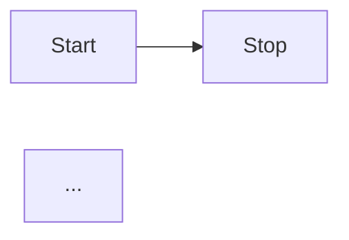
#### Component
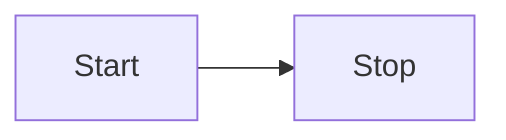

# Node with Text
-------------------------
#### Markdown Example
```markdown
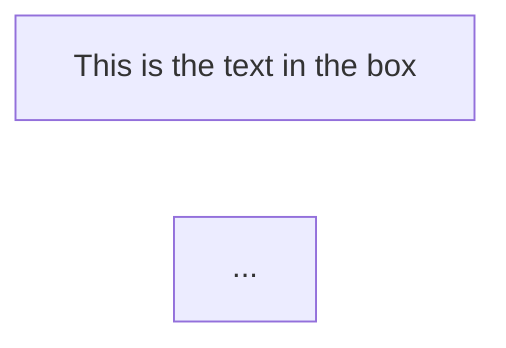
#### Component
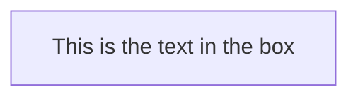


# Sequence Diagram with Note
-------------------------
See more on sequence diagram syntax here - [Mermaid sequence diagram syntax](https://mermaid-js.github.io/mermaid/#/sequenceDiagram)
#### Markdown Example
```markdown
```mermaid
sequenceDiagram
    Alice->John: Hello John, how are you?
    Note over Alice,John: A typical interaction
...
```
#### Component
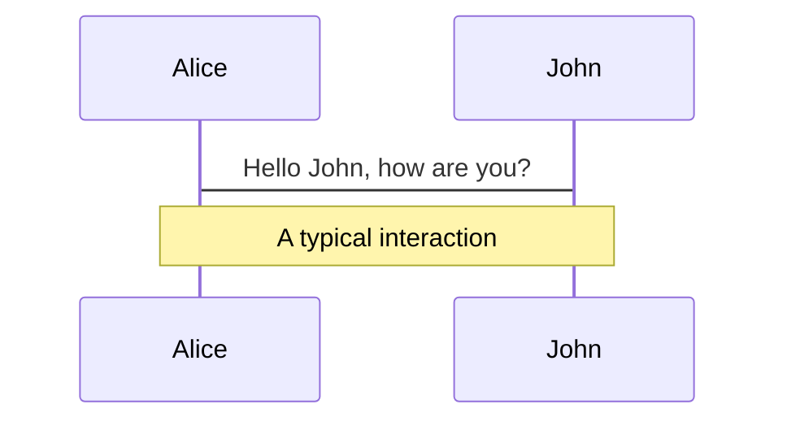

# Class Diagram
-------------------------
See more on class diagram syntax here - [Mermaid class diagram syntax](https://mermaid-js.github.io/mermaid/#/classDiagram)
#### Markdown Example
```markdown
```mermaid
classDiagram
  direction RL
  class Student {
    -idCard : IdCard
  }
  class IdCard{
    -id : int
    -name : string
  }
  class Bike{
    -id : int
    -name : string
  }
  Student "1" --o "1" IdCard : carries
  Student "1" --o "1" Bike : rides
...
```
#### Component
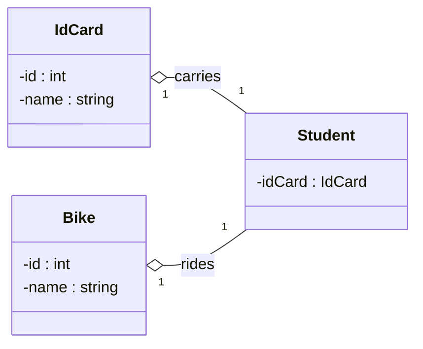

# Class Diagram
-------------------------
See more on state diagram syntax here - [Mermaid state diagram syntax](https://mermaid-js.github.io/mermaid/#/stateDiagram)
#### Markdown Example
```markdown
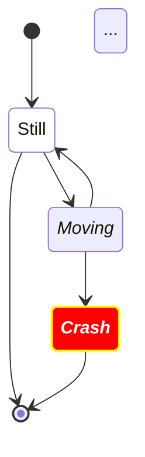
#### Component
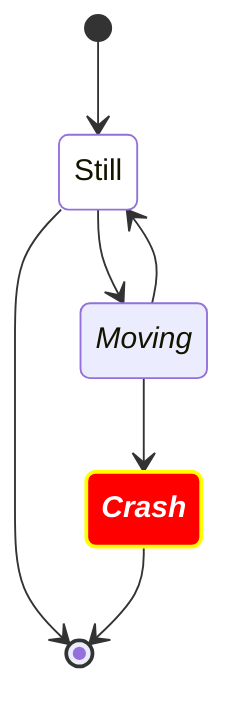

# Relationship Diagram
-------------------------
See more on relationship diagram syntax here - [Mermaid relationship diagram syntax](https://mermaid-js.github.io/mermaid/#/entityRelationshipDiagram)
#### Markdown Example
```markdown
```mermaid
erDiagram
    CAR ||--o{ NAMED-DRIVER : allows
    CAR {
        string registrationNumber PK
        string make
        string model
        string[] parts
    }
    PERSON ||--o{ NAMED-DRIVER : is
    PERSON {
        string driversLicense PK "The license #"
        string(99) firstName "Only 99 characters are allowed"
        string lastName
        string phone UK
        int age
    }
    NAMED-DRIVER {
        string carRegistrationNumber PK, FK
        string driverLicence PK, FK
    }
    MANUFACTURER only one to zero or more CAR : makes
...
```
#### Component
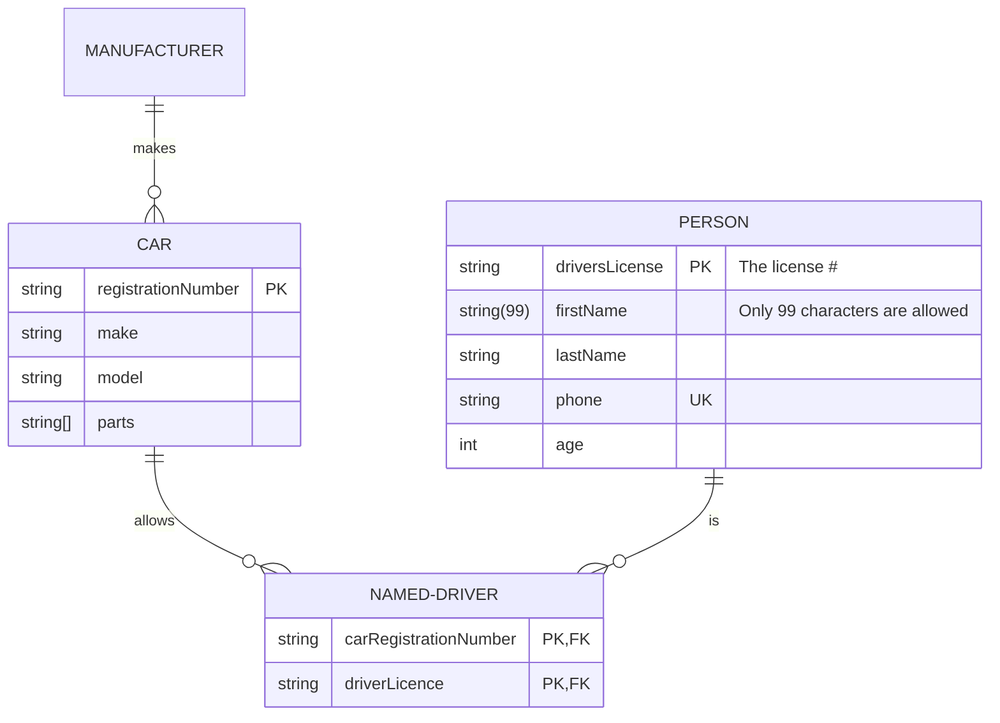

# User Journey Diagram
-------------------------
See more on user journey diagram syntax here - [Mermaid user journey diagram syntax](https://mermaid-js.github.io/mermaid/#/user-journey)
#### Markdown Example
```markdown
```mermaid
journey
    title My working day
    section Go to work
      Make tea: 5: Me
      Go upstairs: 3: Me
      Do work: 1: Me, Cat
    section Go home
      Go downstairs: 5: Me
      Sit down: 5: Me
...
```
#### Component
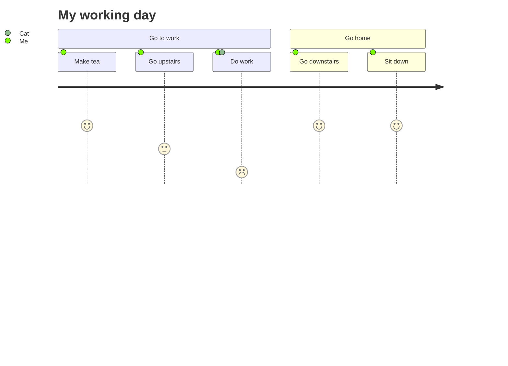

# Gantt Diagram
-------------------------
See more on gantt diagram syntax here - [Mermaid gantt diagram syntax](https://mermaid-js.github.io/mermaid/#/gantt)
#### Markdown Example
```markdown
```mermaid
gantt
    dateFormat  YYYY-MM-DD
    title       Adding GANTT diagram functionality to mermaid
    excludes    weekends
    %% (`excludes` accepts specific dates in YYYY-MM-DD format, days of the week ("sunday") or "weekends", but not the word "weekdays".)

    section A section
    Completed task            :done,    des1, 2014-01-06,2014-01-08
    Active task               :active,  des2, 2014-01-09, 3d
    Future task               :         des3, after des2, 5d
    Future task2              :         des4, after des3, 5d

    section Critical tasks
    Completed task in the critical line :crit, done, 2014-01-06,24h
    Implement parser and jison          :crit, done, after des1, 2d
    Create tests for parser             :crit, active, 3d
    Future task in critical line        :crit, 5d
    Create tests for renderer           :2d
    Add to mermaid                      :1d
    Functionality added                 :milestone, 2014-01-25, 0d

    section Documentation
    Describe gantt syntax               :active, a1, after des1, 3d
    Add gantt diagram to demo page      :after a1  , 20h
    Add another diagram to demo page    :doc1, after a1  , 48h

    section Last section
    Describe gantt syntax               :after doc1, 3d
    Add gantt diagram to demo page      :20h
    Add another diagram to demo page    :48h
...
```
#### Component
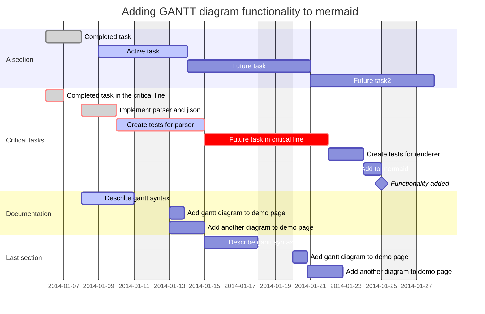

# Pie Chart
-------------------------
See more on pie chart syntax here - [Mermaid pie chart syntax](https://mermaid-js.github.io/mermaid/#/pie)
#### Markdown Example
```markdown
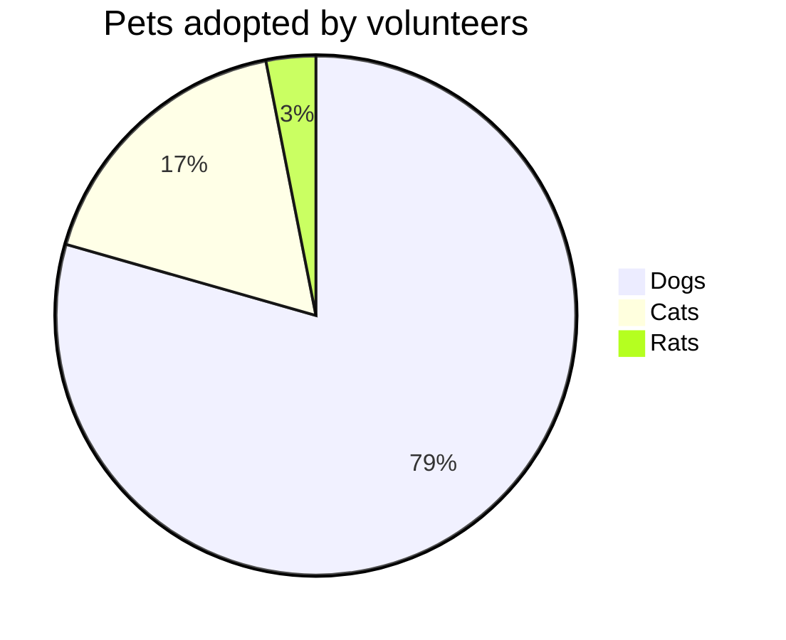
#### Component


# Quadrant Diagram
-------------------------
See more on quadrant diagram syntax here - [Mermaid quadrant diagram syntax](https://mermaid.js.org/syntax/quadrantChart.html)

#### Markdown Example
```markdown
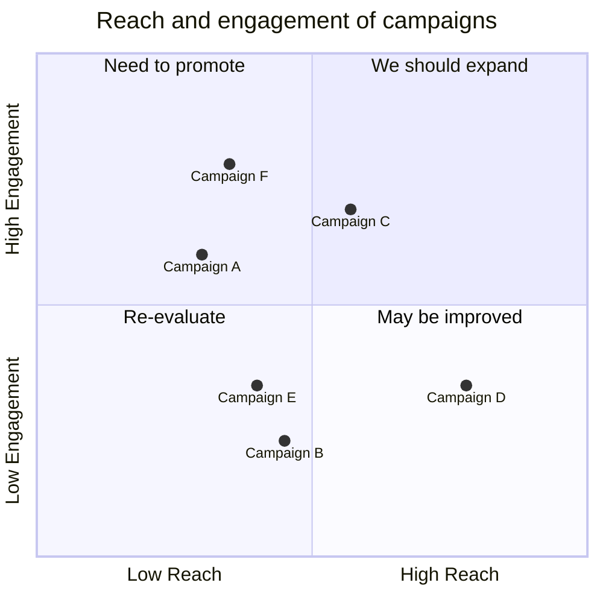
#### Component


# Requirement Diagram
-------------------------
See more on requirement diagram syntax here - [Mermaid requirement diagram syntax](https://mermaid-js.github.io/mermaid/#/requirementDiagram)
#### Markdown Example
```markdown
```mermaid
requirementDiagram

    requirement test_req {
    id: 1
    text: the test text.
    risk: high
    verifymethod: test
    }

    element test_entity {
    type: simulation
    }

    test_entity - satisfies -> test_req
```
#### Component
```mermaid
requirementDiagram

    requirement test_req {
    id: 1
    text: the test text.
    risk: high
    verifymethod: test
    }

    element test_entity {
    type: simulation
    }

    test_entity - satisfies -> test_req
```

# Git Diagram
-------------------------
See more on git diagram syntax here - [Mermaid git diagram syntax](https://mermaid.js.org/syntax/gitgraph.html)

#### Markdown Example
```markdown
```mermaid
gitGraph
       commit id: "1"
       commit id: "2"
       branch nice_feature
       checkout nice_feature
       commit id: "3"
       checkout main
       commit id: "4"
       checkout nice_feature
       branch very_nice_feature
       checkout very_nice_feature
       commit id: "5"
       checkout main
       commit id: "6"
       checkout nice_feature
       commit id: "7"
       checkout main
       merge nice_feature id: "customID" tag: "customTag" type: REVERSE
       checkout very_nice_feature
       commit id: "8"
       checkout main
       commit id: "9"
```
#### Component
```mermaid
gitGraph
       commit id: "1"
       commit id: "2"
       branch nice_feature
       checkout nice_feature
       commit id: "3"
       checkout main
       commit id: "4"
       checkout nice_feature
       branch very_nice_feature
       checkout very_nice_feature
       commit id: "5"
       checkout main
       commit id: "6"
       checkout nice_feature
       commit id: "7"
       checkout main
       merge nice_feature id: "customID" tag: "customTag" type: REVERSE
       checkout very_nice_feature
       commit id: "8"
       checkout main
       commit id: "9"
```

# Mindmap
-------------------------
See more on mindmap syntax here - [Mermaid mindmap syntax](https://mermaid-js.github.io/mermaid/#/mindmap)
#### Markdown Example
```markdown
```mermaid
mindmap
  root((mindmap))
    Origins
      Long history
      ::icon(fa fa-book)
      Popularisation
        British popular psychology author Tony Buzan
    Research
      On effectiveness<br/>and features
      On Automatic creation
        Uses
            Creative techniques
            Strategic planning
            Argument mapping
    Tools
      Pen and paper
      Mermaid
        ::icon(fa fa-table)
```
#### Component
```mermaid
mindmap
  root((mindmap))
    Origins
      Long history
      ::icon(fa fa-book)
      Popularisation
        British popular psychology author Tony Buzan
    Research
      On effectiveness<br/>and features
      On Automatic creation
        Uses
            Creative techniques
            Strategic planning
            Argument mapping
    Tools
      Pen and paper
      Mermaid
        ::icon(fa fa-table)
```

# Timeline
-------------------------
See more on timeline syntax here - [Mermaid mindmap syntax](https://mermaid.js.org/syntax/timeline.html)
#### Markdown Example
```markdown
```mermaid
timeline
    title History of Social Media Platform
    2002 : LinkedIn
    2004 : Facebook
         : Google
    2005 : Youtube
    2006 : Twitter
```
#### Component
```mermaid
timeline
    title History of Social Media Platform
    2002 : LinkedIn
    2004 : Facebook
         : Google
    2005 : Youtube
    2006 : Twitter
```

:SDF
:.>
